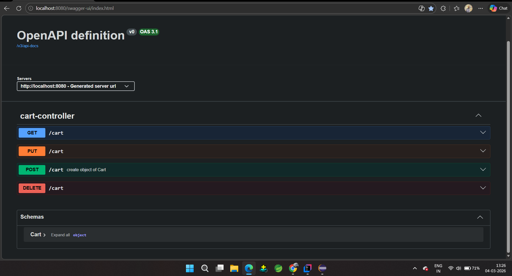
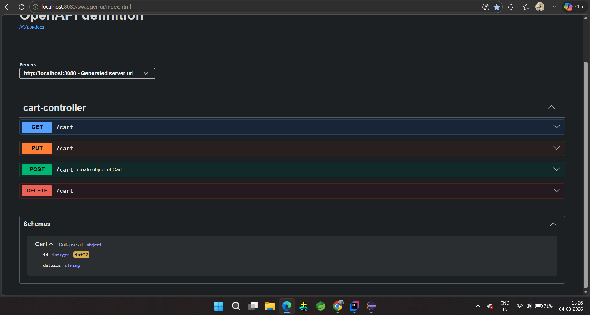

# Cart CRUD Project

This is a **Spring Boot** project for managing **Cart** records with full **CRUD operations**. The project uses **PostgreSQL** for persistent storage and **Swagger (OpenAPI)** for API documentation and testing.

---

## 🛠️ Technology Stack

- **Backend:** Java, Spring Boot  
- **Database:** PostgreSQL  
- **API Documentation:** Swagger (OpenAPI)  
- **Build Tool:** Maven  

## 📸 Swagger UI – Cart Endpoints

This screenshot shows all available Cart API endpoints.

## 📸 Swagger UI – Cart Schema

This screenshot shows the Cart model structure (id, details).

